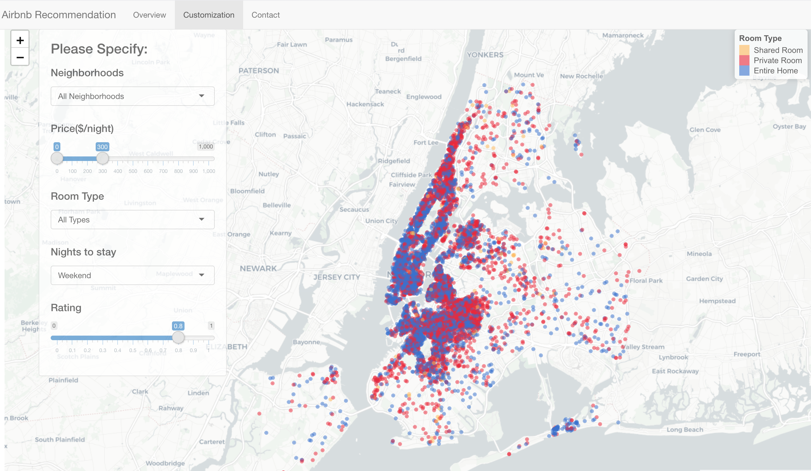

# Project 2: Shiny App Development Version 2.0

### [Project Description](doc/project2_desc.md)


## Airbnb Helper
https://jujuzyt.shinyapps.io/app_new/

Term: Fall 2019

Team : Section 1 Group 3

+ **Team Members**: 
	+ Xiwen Chen | xc2463@columbia.edu
	+ Daniel Weiss | dmw2180@columbia.edu
  + Nichole Yao | yy2860@columbia.edu
  + Justine Zhang | yz3420@columbia.edu
  + Jerry Zhang | jz2966@columbia.edu

+ **Project summary**: 


Airbnb is a mature home-rental platform with 33.9 million users. This app is an Airbnb listing search engine designed for first-time visitors to New York. It can help users make a wiser choice in Airbnb based on their preference for restaurants, facilities, and the trade-off between housing prices and ratings. In this project, we employed comprehensive datasets including Airbnb listing details, Airbnb reviews, Yelp restaurant ratings, and NYC facility information.

On the 'Overview' map, 

On the 'Customization' page, the first impression a tourist will get is the distribution of average Airbnb housing prices in different neighborhoods. The deeper the color, the higher the price. After setting the favorite neighborhood, price range, room type and the number of nights to stay, tourists can locate the housings which fit them the best. Besides, we allow users to set the minimum rating to further filter. They can also play with the trade-off between price and rating to optimize their choice. Once users find their favorite listings, they can click on the small circle on the map to view the housing details, including price, number of reviews and Airbnb URL. By clicking the Airbnb URL, they will go directly to the Airbnb website of this listing to contact the house owner. 


+ **Contribution statement**: ([default](doc/a_note_on_contributions.md))<br>


Following [suggestions](http://nicercode.github.io/blog/2013-04-05-projects/) by [RICH FITZJOHN](http://nicercode.github.io/about/#Team) (@richfitz). This folder is orgarnized as follows.

```
proj/
├── app/
├── lib/
├── data/
├── doc/
└── output/
```

Please see each subfolder for a README file.
